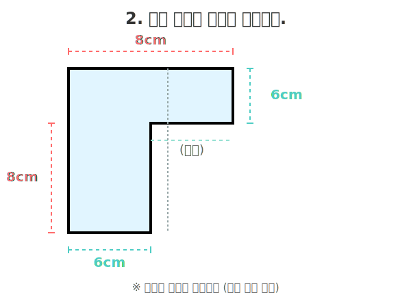
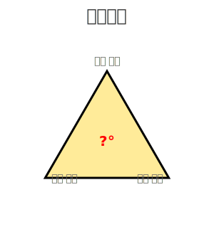
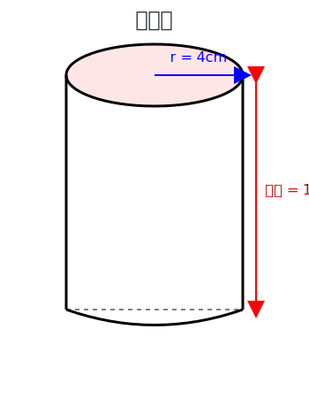
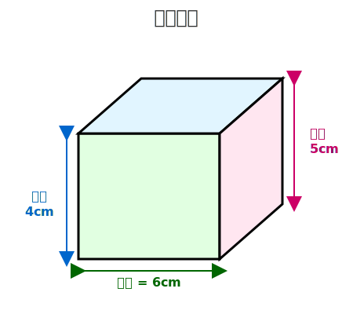

# 초등학교 6학년 학습 평가 - 2주차

## 📘 영어 문제 (10문제)

**1. 다음 중 복수형이 올바른 것은?**

- (A) childs
- (B) childrens
- (C) children
- (D) childs'

**2. 빈칸에 알맞은 be동사를 고르세요.**
"My brother **\_** a teacher."

- (A) am
- (B) is
- (C) are
- (D) be

**3. 다음 중 반대말 짝이 잘못된 것은?**

- (A) hot - cold
- (B) fast - slow
- (C) big - small
- (D) happy - angry

**4. "나는 피자를 좋아한다"를 영어로 바르게 쓴 것은?**

- (A) I likes pizza.
- (B) I like pizza.
- (C) I am like pizza.
- (D) I liking pizza.

**5. 다음 대화에서 빈칸에 알맞은 말은?**
A: "How are you?"
B: "**\_**"

- (A) I'm 12 years old.
- (B) I'm fine, thank you.
- (C) Yes, I am.
- (D) It's Monday.

---

**6. 다음 문장을 과거진행형으로 바르게 바꾼 것은?**
원문: "They play soccer."

- (A) They were playing soccer.
- (B) They are playing soccer.
- (C) They played soccer.
- (D) They have played soccer.

**7. 다음 중 문법적으로 틀린 문장은?**

- (A) She doesn't like coffee.
- (B) He can plays the piano.
- (C) We should study hard.
- (D) I have been to Seoul.

**8. 빈칸에 공통으로 들어갈 전치사는?**
"I'm good **\_** math."
"She is interested **\_** music."

- (A) at, in
- (B) in, at
- (C) for, with
- (D) with, for

**9. 다음 대화의 빈칸에 가장 자연스러운 표현은?**
A: "I failed the test."
B: "**\_**"

- (A) Congratulations!
- (B) That's too bad. Better luck next time.
- (C) You're welcome.
- (D) Nice to meet you.

**10. 다음 문장에서 관계대명사를 사용하여 두 문장을 하나로 바르게 연결한 것은?**
"I have a friend." + "She lives in Busan."

- (A) I have a friend who lives in Busan.
- (B) I have a friend which lives in Busan.
- (C) I have a friend she lives in Busan.
- (D) I have a friend and lives in Busan.

---

## 🔢 수학 문제 (10문제)

**1. 다음 계산의 결과는?**

$$\frac{3}{5} + \frac{1}{5} = ?$$

**답:**

---

**2. 다음 도형의 둘레를 구하세요.**

**답:**

---

**3. 소수를 분수로 바르게 나타내세요.**

$$0.25 = ?$$

**답:**

---

**4. 다음 비례식에서 x의 값은?**

$$3 : 6 = x : 12$$

**답:**

---

**5. 정삼각형의 한 각의 크기는?**

**답:**

---

**6. 다음 분수의 계산 결과를 기약분수로 나타내세요.**

$$\frac{5}{6} - \frac{2}{9} = ?$$

**답:**

---

**7. 원기둥의 부피를 구하세요. (π = 3.14)**

$$V = \pi r^2 h$$

**답:**

---

**8. 다음 식을 계산하세요.**

$$2.4 \div 0.6 \times 3 = ?$$

**답:**

---

**9. 어느 직육면체의 겉넓이를 구하세요.**

**겉넓이 공식:**

$$S = 2(ab + bc + ca)$$

여기서 a = 6cm, b = 4cm, c = 5cm

**답:**

---
